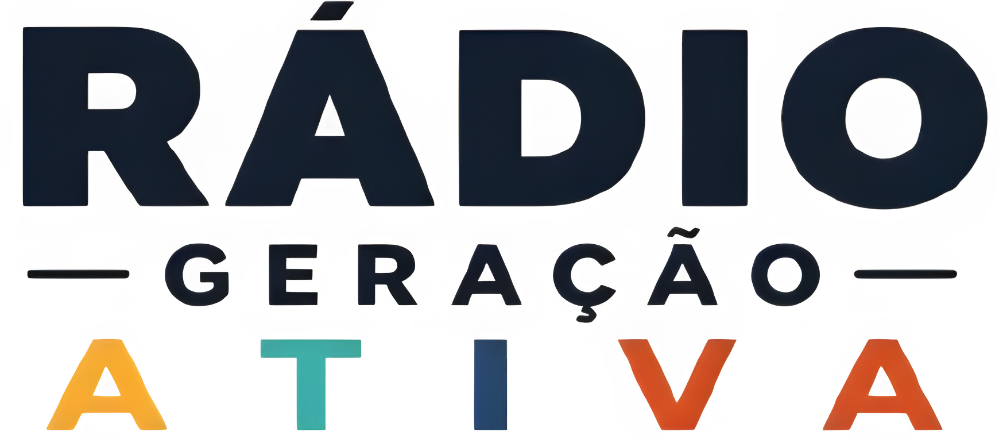

<div align="center">



# 📻 Rádio Geração Ativa

### *Informação, educação e entretenimento em um só lugar.*


</div>

---

# 📖 Sobre

O **Rádio Geração Ativa** é um projeto desenvolvido para a rádio escolar do **UNASP São Paulo**.

O objetivo é oferecer uma plataforma moderna para divulgar:

- 📰 Notícias
- 🎵 Programação da rádio
- 🎙️ Quadros
- 📅 Eventos
- 📻 Playlist
- 👥 Equipe
- 📢 Avisos importantes

Além do site público, o projeto conta com uma área administrativa para gerenciamento do conteúdo.

---

# ✨ Funcionalidades

- ✅ Página inicial responsiva
- ✅ Player de rádio
- ✅ Playlist dinâmica
- ✅ Sistema de programação
- ✅ Página Sobre
- ✅ Área administrativa
- ✅ Atualização de conteúdo
- ✅ Interface moderna
- 🚧 Novas funcionalidades em desenvolvimento

---

# 🖥️ Tecnologias

Este projeto foi desenvolvido utilizando:

- HTML5
- CSS3
- JavaScript (Vanilla)
- Git
- GitHub

---

# 📂 Estrutura do Projeto

```text
📦 radio-geracao-ativa
│
├── admin/
│   ├── admin.js
│   ├── admin.html
│   └── admin.css
│
├── assets/
│   ├── logo.png
│   └── icon.png
│
├── pages/
│   ├── playlist.html
│   ├── publi.html
│   └── sobre.html
│
├── scripts/
│   ├── playlist.js
│   ├── menu.js
│   └── publi.js
│
├── style/
│   ├── playlist.css
│   ├── index.css
│   └── publi.css
│
├── index.html
└── README.md
```

---

# 🎯 Objetivos do Projeto

- Criar um portal oficial da Rádio Geração Ativa.
- Facilitar a divulgação das programações.
- Melhorar a comunicação com os alunos.
- Disponibilizar informações atualizadas.
- Servir como projeto educacional para desenvolvimento web.

---

# 🚀 Como executar

Clone o repositório:

```bash
git clone https://github.com/tiagoalmeida1605/Radio-Geracao-Ativa.git
```
Entre na pasta:

```bash
cd Radio-Geracao-Ativa
```
Abra o arquivo:

```text
index.html
```
ou utilize a extensão **Live Server** (VS Code) ou uma **Run Configuration** no **WebStorm**.

---

# 📷 Prévia

> Em breve serão adicionadas imagens do projeto.

---

# 📌 Status

🚧 Projeto em desenvolvimento.

Novas funcionalidades estão sendo implementadas constantemente.

---

# 🤝 Contribuição

Caso queira contribuir:

1. Faça um Fork
2. Crie uma Branch
3. Faça suas alterações
4. Commit
5. Push
6. Abra um Pull Request

---

# 👨‍💻 Desenvolvedor

**Tiago Almeida**

Estudante do Ensino Médio Técnico em Informática  
UNASP São Paulo

GitHub:
> https://github.com/tiagoalmeida1605

---

<div align="center">

### 📻 Rádio Geração Ativa

**"Conectando informação, educação e esperança."**

⭐ Se gostou do projeto, deixe uma estrela no repositório!

</div>
